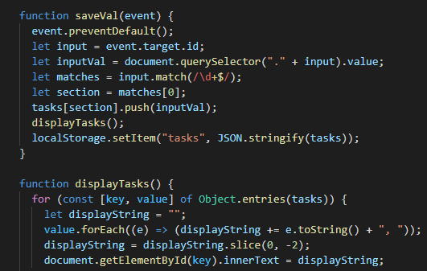

# Work Day Scheduler
A calendar app for scheduling your work day

## Functionality
This is a very simple app that takes data input from the user for each hour and displays tasks on the page. The top of the page displays the current date and time using moment js. The user can enter multiple taks for each time slot and I wrote a display function that separates each item with a comma and a space. Then after the last task it slices the string to remove the comma and the space for a clean presentation. The inputted data is then stored in local storage. 

## Code Snip

## Built With
* [Regex Input Validation](https://gist.github.com/Alix1713/d438dd7d51deed9332f7bf80b3964515)
* [JSON Parse](https://developer.mozilla.org/en-US/docs/Web/JavaScript/Reference/Global_Objects/JSON/parse)
* [Local Storage](https://developer.mozilla.org/en-US/docs/Web/API/Window/localStorage)
* [Moment.js](https://momentjs.com/)
* [Sliced String](https://www.w3schools.com/jsref/jsref_slice_string.asp)

## Deployed Link

* [See Live Site](https://alix1713.github.io/planner/)

## Author **Alix Friedman** 

- [Link to Github](https://github.com/alix1713)
- [Link to LinkedIn](https://www.linkedin.com/in/alix1713/)

## Acknowledgment
